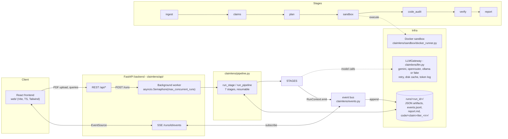
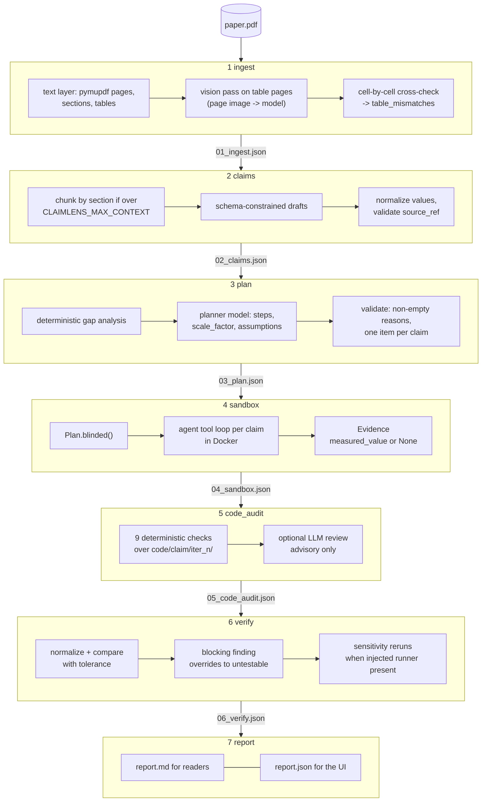
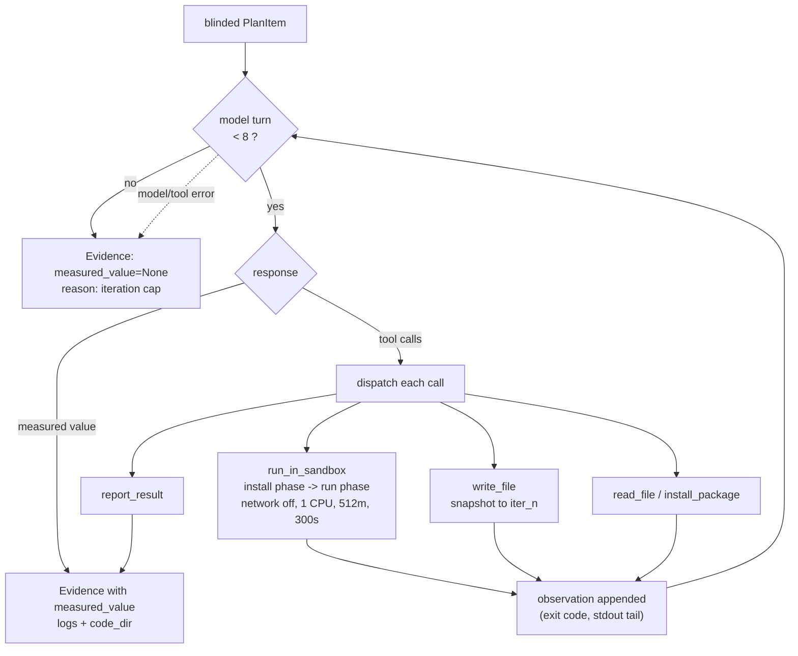
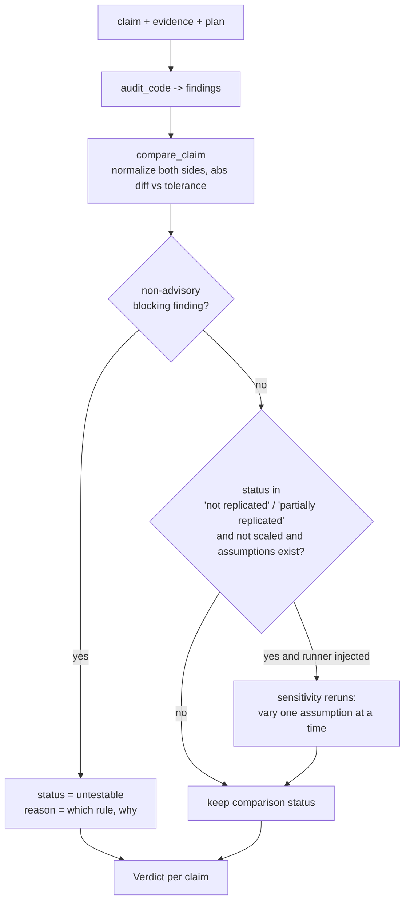
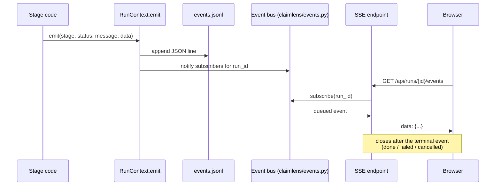

# ClaimLens


ClaimLens audits a computer science research paper claim by claim.

Given a paper PDF it extracts testable claims, plans a reproduction,
runs reduced-scale experiments in a Docker sandbox, compares measured
results to reported numbers in code, and writes a verdict report per
claim.

It is an auditor, not a code generator. The output is a verdict for
each claim (`replicated`, `partially replicated`, `not replicated`,
`untestable`, `untestable at this scale`) with evidence and rationale,
not just a repository.

## Contents

- [Status](#status)
- [Architecture](#architecture)
- [Pipeline](#pipeline)
- [Stages in detail](#stages-in-detail)
  - [1. ingest](#1-ingest)
  - [2. claims](#2-claims)
  - [3. plan](#3-plan)
  - [4. sandbox](#4-sandbox)
  - [5. code_audit](#5-code_audit)
  - [6. verify](#6-verify)
  - [7. report](#7-report)
- [Blinded generation](#blinded-generation)
- [Run directory layout](#run-directory-layout)
- [Events and live updates](#events-and-live-updates)
- [API](#api)
- [Frontend](#frontend)
- [Setup](#setup)
- [CLI usage](#cli-usage)
- [Configuration](#configuration)
- [Testing and CI](#testing-and-ci)
- [Evaluation](#evaluation)
- [Hard rules](#hard-rules)
- [Limits](#limits)

## Status

All seven pipeline stages are implemented, the FastAPI backend and the
React frontend are wired to them, and the test suites pass.

[`docs/eval.md`](docs/eval.md) records the evaluation run of
2026-10-04. Its verdict-comparison section was written before the
sandbox and verify stages landed and still reports them as blocked, so
the evaluation needs a rerun.

Stage interfaces are frozen in [`docs/CONTRACTS.md`](docs/CONTRACTS.md);
team ownership and workflow are in [`AGENTS.md`](AGENTS.md) and
[`CONTRIBUTING.md`](CONTRIBUTING.md).

## Architecture



Design points:

- **One model gateway.** Every model call goes through
  `claimlens/llm.py`. No other file imports a model SDK.
- **Deterministic verification.** `claimlens/verify/compare.py` imports
  no gateway; numbers are normalized and compared in Python with
  explicit tolerances.
- **Docker only.** Generated experiment code runs inside a container,
  never on the host.
- **Artifacts on disk.** Each stage writes one JSON file, so any stage
  can be re-run from saved inputs.

## Pipeline



`run_pipeline()` walks `STAGE_ORDER`
(`ingest, claims, plan, sandbox, code_audit, verify, report`) and passes
each stage's output to the next in memory; `run_stage()` reloads any
missing input from disk, so `--from-stage` resumes a run without
re-doing earlier work.

## Stages in detail

| # | Stage | Entry point | Output |
|---|---|---|---|
| 1 | ingest | `claimlens.ingest.parse.parse_paper` | `01_ingest.json` (`ParsedPaper`) |
| 2 | claims | `claimlens.claims.extract.extract_claims` | `02_claims.json` (list of `Claim`) |
| 3 | plan | `claimlens.plan.build.build_plan` | `03_plan.json` (`Plan`) |
| 4 | sandbox | `claimlens.sandbox.run_experiments` | `04_sandbox.json` (list of `Evidence`) |
| 5 | code_audit | `claimlens.verify.code_audit.audit_code` | `05_code_audit.json` (list of `CodeFinding`) |
| 6 | verify | `claimlens.verify.verify_claims` | `06_verify.json` (list of `Verdict`) |
| 7 | report | `claimlens.report.render.render_report` | `report.md`, `report.json`, `07_report.json` |

### 1. ingest

- `pymupdf` extracts per-page lines; sections are split on numbered
  `N. Title` heading lines (`claimlens/ingest/pdf_text.py`).
- Tables come from two independent sources: the PDF text layer
  (`find_tables` plus pipe-row parsing) and a vision read of rendered
  page images at 150 dpi (`claimlens/ingest/tables.py`).
- The vision pass only covers pages that carry a caption or a
  text-layer table, to save model quota.
- The two readings are paired and compared cell by cell. Every
  difference is recorded in `table_mismatches` with both values; the
  mismatch is flagged, never silently resolved (hard rule 8).
- Progress events are emitted per page, section, table and mismatch.

### 2. claims

- The parsed paper is chunked by section when it exceeds
  `CLAIMLENS_MAX_CONTEXT`; drafts are requested with a JSON schema
  (`ClaimDraft`) and validated in code.
- `normalize_value` stores percentages and percentage points as
  fractions (91.2% -> 0.912); ratios and counts pass through.
  `tolerance` uses the same units and defaults to `0.01`.
- `source_ref` must name a real section or table id (`s1`, `t1`);
  anything else is rejected. The page number shown in the UI is derived
  from that reference.
- Claims are unusable without a `source_ref`, so every claim points at
  a location in the paper.

### 3. plan

- `claimlens/plan/gaps.py` does deterministic gap analysis: settings
  the paper states versus details a reproduction needs.
- The planner model returns per-claim items (steps, `scale_factor`,
  `scale_reason`, config) and an assumption log, under schema-
  constrained output with retries.
- Validation rejects planner output when any assumption has an empty
  reason, when an item targets an unknown claim, or when a claim is
  left without an item. Ids (`a1`, `a2`, ...) are assigned by code, not
  by the model.
- Every detail the paper omits that the agent fills in is logged as an
  `Assumption`: detail, value chosen, reason, confidence
  (low/medium/high) — hard rule 4.

### 4. sandbox

- The pipeline calls the sandbox with `Plan.blinded(claims)` only (see
  [Blinded generation](#blinded-generation)).
- One agent loop per plan item (`claimlens/sandbox/agent.py`), hard cap
  `MAX_ITERATIONS = 8` model turns. The agent acts only through five
  function calls:

  | Tool | Effect |
  |---|---|
  | `write_file` | write a file into the claim workdir |
  | `read_file` | read a file (truncated at 4000 chars) |
  | `run_in_sandbox` | execute a command in Docker, network disabled |
  | `install_package` | record a PyPI package for the next run phase |
  | `report_result` | finish with the final measured number |

- Execution goes through `docker_runner.run_in_docker` in two phases:
  1. **Install** (network enabled): `pip install` the recorded
     packages.
  2. **Run** (network disabled): the experiment command with CPU
     (`1.0`), memory (`512m`) and wall-clock limits (`300s`), output
     capped at 1 MB.
- Every iteration's code is snapshotted to
  `runs/<id>/code/<claim_id>/iter_<n>/` before it runs; every write
  emits a `code_written` event carrying claim id, iteration and file
  name only.
- Progress guards: a nudge after two writes without a run, and an
  auto-run of the largest `.py` after three, so a refining model still
  executes something.
- The result must appear as `MEASURED <number>` in sandbox stdout or be
  passed to `report_result`. A failed, capped or errored loop returns
  `Evidence` with `measured_value = None` and a failure note — never an
  invented number.



### 5. code_audit

Deterministic checks over `runs/<id>/code/<claim_id>/iter_<n>/`
(`claimlens/verify/code_audit.py`), all with `advisory = False`:

| Rule | Severity | What it catches |
|---|---|---|
| `code-present` | blocking | no experiment code was produced for the claim |
| `hardcoded-result` | blocking | the reported number appears in the code instead of being measured |
| `train-test-overlap` | blocking | the same data used for training and evaluation |
| `results-from-file` | warning | a results file is read that the code never writes |
| `seed-not-set` | warning | randomness used without a fixed seed |
| `missing-hyperparameter` | warning | a plan config value appears nowhere in the code |
| `dataset-mismatch` | warning | the code names a different dataset than the claim |
| `metric-mismatch` | warning | the claim's metric is never computed or mentioned |
| `unpinned-dependency` | info | a dependency is installed without a pinned version |
| `small-sample` | info | a sample size under 100, or a slice of 50 rows or fewer |

All of them carry `advisory = False`; the three blocking rules are what
turn a claim `untestable` in the verify stage.

`claimlens/verify/code_review.py` adds a model review of the same code,
but its findings are `advisory = True` and can never change a verdict.
Invalid model output or a missing gateway yields no findings rather than
an error.

### 6. verify

`verify_claims()` in `claimlens/verify/__init__.py` runs the audit,
compares each claim, then applies the blocking rule:



Comparison rules (`claimlens/verify/compare.py`):

- Both sides are normalized the same way; the metric name decides
  whether a value is a percentage (so a 2x speedup is never read as
  200%).
- `|measured - reported| <= tolerance` (default `0.01`) → match;
  within `3 x tolerance` → `partially replicated` (near match);
  beyond that → `not replicated`.
- If `scale_factor < 1.0` the run is scaled: the strongest allowed
  outcomes are `partially replicated` and `untestable at this scale`.
  A scaled run can never refute a paper, and the rationale states what
  the run does and does not show.
- A non-advisory `blocking` finding overrides the numeric result to
  `untestable`, even on a numeric match.
- Every claim is resolved, including as `untestable`. Only this stage
  may finish a claim.

### 7. report

`render_report` writes two files (`claimlens/report/render.py`):

- `report.md` — summary table, then per-claim sections with reported vs
  measured values, the verdict and rationale, sensitivity effects,
  scale limitations, logs and the full assumption log. Readable without
  opening any other file.
- `report.json` — the verdict list unchanged, for the UI.

## Blinded generation

The coding agent never receives reported values (hard rule 10):

- `Plan.blinded(claims)` returns a copy of the plan with every
  reported value removed from steps, scale reasons, string config
  values and assumption text. Numeric hyperparameters are preserved.
- The sandbox stage is called only with that blinded plan. Claims,
  paper text and previous verdicts are never passed to the agent.
- A test fails if any reported value appears in a prompt sent to the
  agent.
- Known limit: integral reported values with no fractional surface form
  are left in place, to avoid destroying ordinary integers.

## Run directory layout

```
runs/<run_id>/
  paper.pdf            # uploaded source
  state.json           # run + per-stage status for the API
  events.jsonl         # progress events, one JSON object per line
  llm_log.jsonl        # token counts per model call
  01_ingest.json       # ParsedPaper
  02_claims.json       # list[Claim]
  03_plan.json         # Plan (items + assumptions)
  04_sandbox.json      # list[Evidence]
  05_code_audit.json   # list[CodeFinding]
  06_verify.json       # list[Verdict]
  07_report.json       # path to report.md
  report.md            # human-readable verdict report
  report.json          # verdicts for the frontend
  04_sandbox_e_c1.log  # sandbox stdout per evidence
  code/c1/iter_1/      # generated code, snapshot per iteration
  code/c1/iter_2/
```

`runs/` is gitignored. Artifact names are fixed in
`claimlens/artifacts.py`.

## Events and live updates



Event status is one of `started`, `progress`, `done`, `failed`. The
event bus keeps a subscriber registry keyed by run id, so pipeline
threads and the asyncio SSE handler meet without the config layer
depending on the API.

## API

Prefix `/api`, defined in `claimlens/api/runs.py`, schema in
`docs/openapi.json`.

| Method | Path | Purpose |
|---|---|---|
| GET | `/health` | liveness |
| GET | `/config` | provider and model names, never keys |
| POST | `/runs` | upload a PDF (max 30 MB, `application/pdf`), start background run, 202 |
| GET | `/runs` | list runs; `?demo=true` filters demos |
| GET | `/runs/{id}` | run detail with per-stage status |
| GET | `/runs/{id}/events` | SSE stream of progress events |
| GET | `/runs/{id}/code` | generated code tree by claim and iteration |
| GET | `/runs/{id}/code/{claim}/{iter}/{index}` | one generated file |
| GET | `/runs/{id}/code.zip` | all generated code as a download |
| GET | `/runs/{id}/{artifact}` | `parsed`, `claims`, `plan`, `evidence`, `verdicts`, `report`, `paper` |
| POST | `/runs/{id}/cancel` | cancel a queued or running run |

Runs execute in a background asyncio task behind
`asyncio.Semaphore(CLAIMLENS_MAX_CONCURRENT_RUNS)`; the real pipeline
runs in a worker thread. Failures are written to `state.json` and
emitted as a run event, so the UI shows them without polling for
errors.

## Frontend

`web/` is a Vite + React 19 + TypeScript app, Tailwind for styling,
React Query for data, `react-pdf` for the paper view,
`highlight.js` for code.

Routes (`web/src/App.tsx`):

| Route | Page | Contents |
|---|---|---|
| `/` | `HomePage` | upload dropzone, health check, run list |
| `/runs/:runId` | `RunPage` | pipeline stepper, claims, verdicts, evidence, code tabs, report, live log |
| `/demos` | `DemosPage` | seeded demo runs |
| `/about` | `AboutPage` | what the tool does and does not claim |

The frontend displays backend verdicts only: no page computes or
changes a verdict (hard rule 9). Views are read from `report.json`,
the stage artifacts and the SSE stream.

## Setup

### Backend

```bash
pip install -e ".[dev]"
cp .env.example .env   # fill in keys; .env is never committed
claimlens serve        # API on http://localhost:8000
```

Docker must be running for real sandbox stages.

### Frontend

```bash
cd web
npm ci
npm run dev            # Vite on http://localhost:5173, /api proxied to :8000
```

The start page calls `/api/health` through the Vite proxy to prove the
connection. After changing the API, regenerate the schema and types:

```bash
claimlens export-openapi   # writes docs/openapi.json
cd web && npm run gen:api  # writes web/src/api/types.ts
```

Frontend checks: `npm run lint`, `npm run typecheck`, `npm run test`,
`npm run build`.

### Mock mode

No API key or Docker needed. The mock pipeline replays canned fixtures
stage by stage:

```bash
CLAIMLENS_MOCK_PIPELINE=1 claimlens serve
```

This seeds two finished demo runs and streams realistic events
(including agent log lines) for every new upload. In production mode
the backend serves the built frontend:

```bash
cd web && npm run build
CLAIMLENS_PROD=1 claimlens serve --prod
```

## CLI usage

```bash
claimlens run paper.pdf --out runs/            # full pipeline
claimlens run paper.pdf --from-stage verify    # resume from a stage
claimlens stage ingest --run-id <id> --pdf p.pdf
claimlens report <run_id>                      # re-render the report
claimlens serve --port 8000
claimlens export-openapi
claimlens --help
```

No API key is needed for tests: set `CLAIMLENS_PROVIDER=fake`.

## Configuration

See `.env.example`. Variables are read in `claimlens/config.py`:

| Variable | Default | Purpose |
|---|---|---|
| `CLAIMLENS_PROVIDER` | `gemini` | `gemini`, `openrouter`, `ollama`, `fake` |
| `CLAIMLENS_MODEL_PLANNER` | `gemma-4-31b-it` | model for `role="planner"` (plan stage) |
| `CLAIMLENS_MODEL_AGENT` | `gemma-4-26b-a4b-it` | model for `role="agent"` (claim drafts, vision table read, sandbox agent, code review) |
| `CLAIMLENS_MODEL_FAST` | `gemma-4-e4b-it` | model for `role="fast"` (reserved for cheap calls) |
| `CLAIMLENS_MAX_CONTEXT` | `30000` | chunk the paper when it exceeds this |
| `GEMINI_API_KEY` / `OPENROUTER_API_KEY` | — | provider credentials, never committed |
| `CLAIMLENS_MOCK_PIPELINE` | `0` | `1` replays fixtures instead of real stages |
| `CLAIMLENS_MAX_CONCURRENT_RUNS` | `1` | extra runs queue behind a semaphore |
| `CLAIMLENS_RUNS_ROOT` | `runs` | run storage directory |
| `CLAIMLENS_CACHE_DIR` | `~/.cache/claimlens/llm` | response cache |
| `CLAIMLENS_NO_SLEEP` | — | set in CI to skip retry backoff |

Gateway behaviour (`claimlens/llm.py`): JSON-schema constrained output,
function calling, exponential backoff on 429 and 5xx, a disk cache
keyed by model and messages hash, and a token count per call appended to
`runs/<id>/llm_log.jsonl`. Context is chunked at
`CLAIMLENS_MAX_CONTEXT`; a 256K window is never assumed.

## Testing and CI

```bash
pytest                          # backend tests
ruff check . && ruff format .   # lint and format
cd web && npm run lint && npm run typecheck && npm run test && npm run build
```

- Tests use `CLAIMLENS_PROVIDER=fake` and canned responses in
  `tests/fixtures/fake_llm_responses.json`; deterministic tests make no
  network calls.
- Docker-dependent tests are marked `@pytest.mark.docker` and skipped
  when no daemon is available (`pytest -m "not docker"` in CI).
- `.github/workflows/ci.yml` runs three jobs: backend lint/format/tests,
  API tests in mock mode (including SSE), and frontend
  lint/typecheck/test/build.

## Evaluation

`examples/<name>/` holds a small paper (`paper.md`) with expected
claims, plan content and predicted verdicts. Run the implemented stages
over all examples and record agreement:

```bash
python -m scripts.evaluate          # writes docs/eval.md
python -m scripts.seed_example_demos # demo=true runs from the examples
```

Model outputs are canned per example, so this checks the deterministic
layers. Results, including failures, are recorded in
[`docs/eval.md`](docs/eval.md).

## Hard rules

These apply to every change; see [`AGENTS.md`](AGENTS.md) for the full
list and rationale.

1. Verification is deterministic code. The model never decides whether
   results match.
2. One model gateway: `claimlens/llm.py`.
3. Gemma 4 only as the runtime model.
4. No silent assumptions: every filled-in detail is logged with reason
   and confidence.
5. Scaled runs cannot refute a paper.
6. Every claim gets a verdict, including `untestable`.
7. Sandbox only: generated code never runs on the host.
8. Table numbers are cross-checked; mismatches are flagged, not
   silently resolved.
9. The frontend displays backend verdicts only.
10. Blinded generation: the coding agent never receives reported
    values.
11. Generated code is a saved artifact per iteration.
12. Code audit happens before the verdict; LLM review is advisory only.
13. Blocking findings invalidate: status `untestable`, never
    `replicated`.

## Limits

- Scaled-down runs cannot refute a paper. Verdicts and reports state
  what scaled runs do and do not show.
- The vision table pass reads only pages with tables, so a table that
  the text layer and the caption both miss is not cross-checked.
- Model output quality bounds claim extraction and planning; bad
  planner output is rejected and retried, and persistent failures stop
  the stage rather than passing through.
- Real-model runs depend on free-tier quotas and network access;
  responses are cached on disk to reduce repeated calls.
